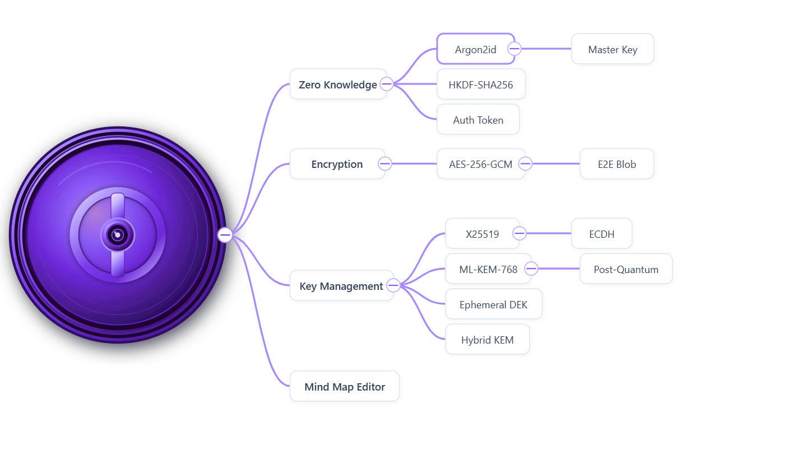

# MindMapVault OSS

MindMapVault OSS is the open-source desktop edition of [MindMapVault](https://www.mindmapvault.com) — a privacy-first, encrypted mind-mapping application.

This repository serves two purposes:
1. **Proof of concept** — demonstrate the zero-knowledge encryption model and local-first architecture that powers the hosted product at [www.mindmapvault.com](https://www.mindmapvault.com).
2. **Security transparency** — allow independent researchers, auditors, and contributors to inspect the client-side encryption design, the Tauri local storage layer, and the CI security procedures.

The commercial hosted service at `app.mindmapvault.com` runs on a separate private backend. This OSS edition covers the **desktop local-only path**. Your vault data stays on your device.

The core promise is simple:
- your map content is encrypted client-side,
- local mode keeps data on your machine,
- and the open-source edition is focused on offline-capable desktop workflows.



## Relationship to the Commercial Product

| | MindMapVault OSS (this repo) | MindMapVault Cloud ([app.mindmapvault.com](https://app.mindmapvault.com)) |
|---|---|---|
| Desktop local mode | ✅ | ✅ |
| Client-side encryption | ✅ | ✅ |
| Encrypted cloud sync | ❌ | ✅ |
| Real-time collaboration | ❌ | ✅ |
| Self-hosted backend | build it yourself | managed |
| Source visible | ✅ this repo | private |

This OSS edition lets anyone audit the encryption layer, build on the local-first architecture, or contribute improvements that may be merged back to the hosted product.

## Who This Is For

- Individuals who want private personal knowledge maps
- Teams evaluating zero-knowledge architecture patterns
- Developers who want a Rust + React + Tauri reference for secure local-first apps
- Security researchers reviewing the client-side encryption and local storage model

## Zero-Knowledge Summary

MindMapVault uses a zero-knowledge-style model for map content:
- plaintext map content is encrypted before persistence,
- encrypted blobs are what get stored,
- decrypted content is handled client-side during active use.

In OSS local mode, this means your encrypted vault data is persisted locally via the Tauri host, not sent to a managed SaaS backend by default.

For deeper design details, see the Security and Architecture document:
- [Security Whitepaper](frontend_app/public/SECURITY.md)

## Architecture

MindMapVault OSS consists of three main layers:

1. React frontend (TypeScript, Vite)
2. Tauri host (Rust)
3. Local encrypted storage (filesystem)

High-level flow:

```text
React UI (frontend_app)
	-> crypto and editor state in client runtime
	-> Tauri commands
Rust host (desktop/src-tauri)
	-> local profile and vault metadata/index management
	-> encrypted blob read/write
Filesystem (AppData)
	-> encrypted profile and vault files
```

### Key Modules

- `frontend_app/`: desktop app UI, editor experience, client-side encryption helpers, storage adapter wiring
- `desktop/src-tauri/`: Rust command handlers for local profile, vault metadata, blob persistence, and storage configuration
- `backend/`: server stack used by cloud/self-hosted paths (included in monorepo, but OSS desktop usage is local-first)

## Local Data Storage Details

In local mode, MindMapVault stores encrypted data in app-managed directories.

Current local vault storage layout includes:
- per-user local profile/config records,
- vault index metadata,
- encrypted vault blobs as `.md` files,
- legacy `.bin` blobs are still readable during migration for backward compatibility.

Implementation reference:
- `desktop/src-tauri/src/local_store.rs`

Important:
- map content is persisted as encrypted payloads,
- local mode is designed so your working data remains on your device.

## OSS Scope

Included in this repository:
- desktop local mode application
- React frontend for mind-map editing
- Tauri Rust host and local persistence

Not included as OSS product operations:
- managed cloud infrastructure operations
- billing/tenant operations
- production hosted control plane

## Screenshots

Current image assets:
- Hero image: [frontend_app/public/vault-mindmap-hero.png](frontend_app/public/vault-mindmap-hero.png)

Planned screenshot set (to be added):
- editor canvas in desktop local mode
- encrypted vault list view
- local unlock flow
- attachment handling and preview flow

## Development

### Prerequisites

- Node.js 20+
- pnpm 10+
- Rust stable
- Tauri prerequisites for your OS

### Install Dependencies

```bash
pnpm install
```

### Run Frontend App

```bash
pnpm run dev:app
```

### Run Desktop App (Tauri Dev)

```bash
pnpm run tauri:dev
```

### Build Desktop App

```bash
pnpm run tauri:build
```

## Automated Security Checks

Every release build runs automated security gates before any artifact is assembled.
These are enforced by the CI pipeline in [`.github/workflows/release-desktop.yml`](.github/workflows/release-desktop.yml).

### What runs on every release tag

| Check | Tool | Scope |
|---|---|---|
| Version consistency gate | Node.js inline script | `frontend_app/package.json`, `tauri.conf.json`, `Cargo.toml` must all match |
| Frontend dependency audit | `pnpm audit --prod` | production npm dependency tree |
| Rust dependency audit | `cargo-audit` | `desktop/src-tauri` Cargo dependency tree |

The build jobs for Windows and Linux only start if all three checks pass. A failed audit or version mismatch blocks the release.

### What this means for you

- You can audit the same checks locally:
  ```bash
  # frontend
  pnpm --dir frontend_app audit --prod

  # rust
  cargo audit --manifest-path desktop/src-tauri/Cargo.toml
  ```
- If you find a dependency with a known advisory that is not yet caught, please open an issue or a pull request.
- For vulnerabilities in the application logic itself (encryption, local storage, Tauri commands), see the responsible disclosure process below.

## Security And Disclosure

- Responsible disclosure policy: [SECURITY.md](SECURITY.md)
- Security architecture and encryption design: [frontend_app/public/SECURITY.md](frontend_app/public/SECURITY.md)

Key design constraints preserved across all builds:
- map content and DEKs never leave the client in plaintext
- the backend (when present) stores only encrypted metadata and encrypted blobs
- local mode data stays on the device under Tauri's app data directory

## Commercial And Hosted Offering

This OSS edition is a demonstration and transparency layer for the commercial product.

- Marketing site: https://www.mindmapvault.com
- Hosted app: https://app.mindmapvault.com

The hosted product runs additional closed-source infrastructure (auth, billing, encrypted sync, real-time collaboration). The encryption model and local-first storage design visible in this repository are the same architecture used in the hosted product.

## Roadmap

See [ROADMAP.md](ROADMAP.md) for planned features, the open-source strategy, and how to contribute ideas.

## License

See repository license files and notices for usage terms.
